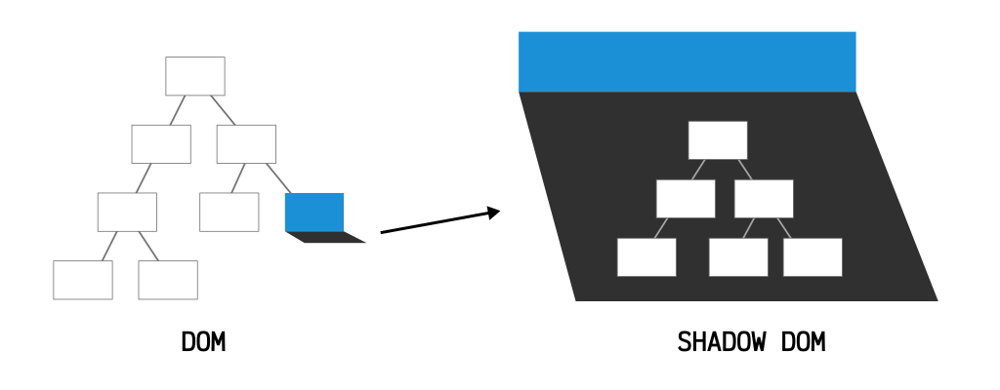

# [WEB COMPONENTS](https://developer.mozilla.org/es/docs/Web/Web_Components)

Es un paquete de diferentes tecnologias que te permite crear elementos personalizados reutilizables

## Para que sirve

Creación de estructuras HTML personalizadas que encapsulan funcionalidad

## En qué consisten

Los webcomponents están basados en tres tecnologias:

- **Custom elements**: Un conjunto de APIs de JavaScript que permiten definir elementos personalizados y su comportamiento, para ser usados en el HTML posteriormente.
- **Shadow DOM**: Un conjunto de APIs de JavaScript para fijar un árbol DOM "sombra" encapsulado a un elemento — que es renderizado por separado del documento DOM principal — y controlando funcionalidad asociada. De esta forma, se pueden mantener características de un elemento en privado, así puede tener el estilo y los scripts sin miedo de colisiones con otras partes del documento.
- **HTML templates**: Los elementos ```<template>``` y ```<slot>``` permiten escribir plantillas de marcado que no son desplegadas en la página renderizada. Éstas pueden ser reutilizadas en múltiples ocasiones como base de la estructura de un elemento personalizado.

## [Qué es un shadow dom](https://lenguajejs.com/webcomponents/nativos/que-es-shadow-dom/)

El concepto de Shadow DOM nace de la necesidad de tener una forma de encapsular elementos y mantenerlos aislados del resto de la página, creando algo así como un concepto local, en contraposición al concepto global con el que se solía trabajar en los navegadores.



Imaginemos que tenemos un árbol DOM del documento de la página en la que nos encontramos. Uno de esos nodos del árbol (destacado en azul) tiene un Shadow DOM (una sombra) en la cuál puede residir otro árbol DOM, que realmente no forma parte del DOM principal de la página.

# Ejemplo 

Vamos a crear un elemento app-image-list que muestre una lista de imagenes que vienen de una url. 